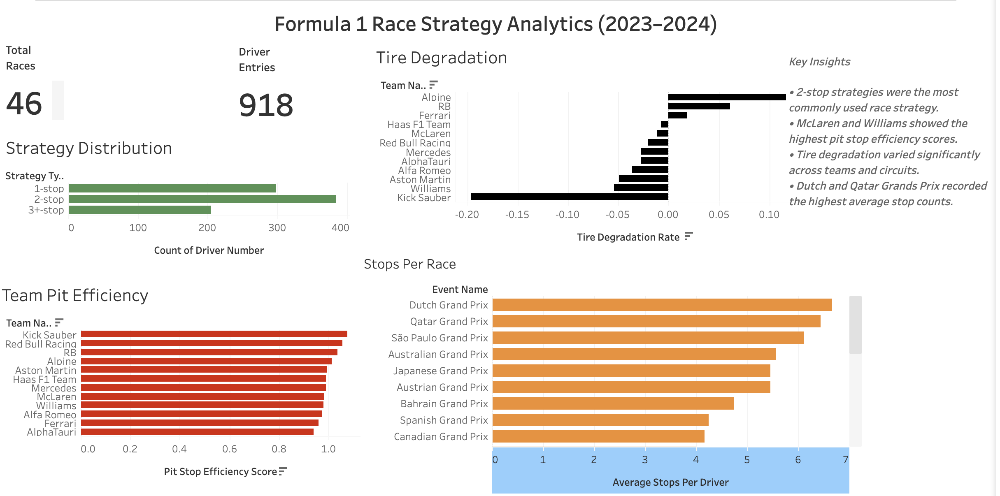
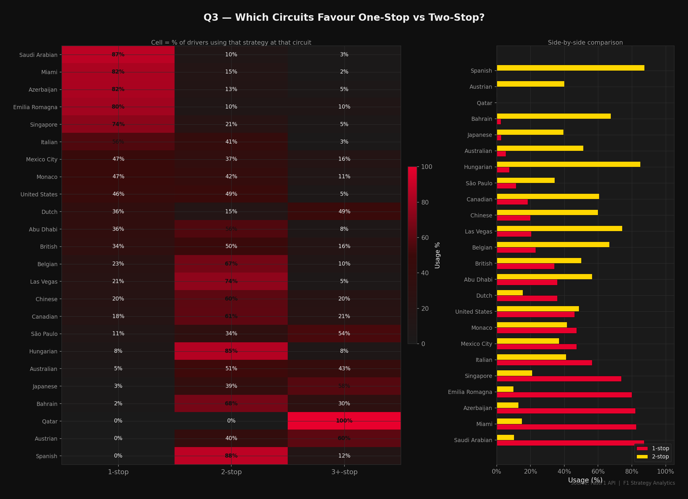
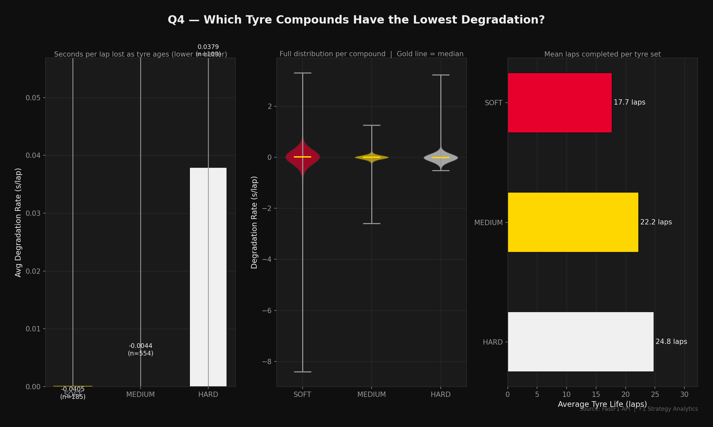
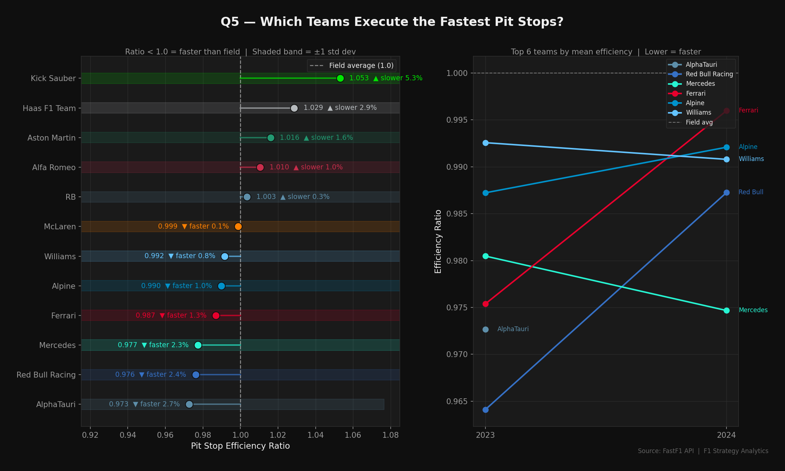

# 🏎️ F1 Race Strategy Analytics

End-to-end Formula 1 analytics platform built with FastF1, Python, Pandas, SQL, Tableau, and Power BI.

Analyzed 46 Formula 1 Grands Prix across the 2023–2024 seasons to uncover insights on race strategies, pit stop performance, and tire degradation.

## Dataset Summary

| Metric | Value |
|----------|----------|
| Seasons Analyzed | 2023–2024 |
| Grand Prix Weekends | 46 |
| Driver-Race Records | 918 |
| Laps Processed | 50,000+ |
| Teams | 10 |
| Circuits | 20+ |

## Overview

Analyzed 46 Formula 1 Grands Prix across the 2023–2024 seasons using FastF1 and Python to study race strategy patterns, pit stop efficiency, and tire degradation.

Built an end-to-end analytics pipeline covering:

- Data Collection
- Data Cleaning
- Feature Engineering
- Exploratory Analysis
- Interactive Dashboarding

The project demonstrates data engineering, exploratory data analysis, sports analytics, and dashboard development skills using real-world Formula 1 telemetry and race data.
Visualizations and dashboards were built using Tableau and Power BI to communicate race strategy insights interactively.

## Tech Stack

- Python
- Pandas
- FastF1
- NumPy
- PyArrow
- Matplotlib
- SQL
- Tableau
- Power BI
- Git & GitHub

## Dashboard Preview



## Key Insights

- Two-stop strategies were the most commonly used race strategy.
- Strategy preference varies significantly by circuit.
- Hard compounds demonstrated the longest average tire life.
- Mercedes and Red Bull showed among the fastest pit stop performances.
- Tire degradation patterns differ substantially across compounds and tracks.

## Key Visualizations

### Circuit Strategy Heatmap



### Tire Degradation Analysis



### Team Pit Stop Efficiency



## Data Pipeline

```text
FastF1 API
    ↓
Data Collection
    ↓
Data Cleaning
    ↓
Feature Engineering
    ↓
Exploratory Analysis
    ↓
Tableau / Power BI Dashboards
```

## Results

- Analyzed 46 Formula 1 Grands Prix
- Processed 50,000+ race laps
- Generated 918 driver-race records
- Built interactive Tableau dashboards
- Produced strategy, tire, and pit stop performance analyses

## How To Run

```bash
git clone https://github.com/MISTYCQ/f1-race-strategy-analytics.git

cd f1-race-strategy-analytics

python -m venv .venv

source .venv/bin/activate

pip install -r requirements.txt

python run_collection.py
python run_cleaning.py
python run_features.py
python run_analysis.py

## Project Structure

```text
config/          Configuration files
data/            Raw, processed and feature datasets
reports/         Analysis outputs and visualizations
src/             Collection, cleaning and analysis modules
tableau_data/    Dashboard-ready datasets
